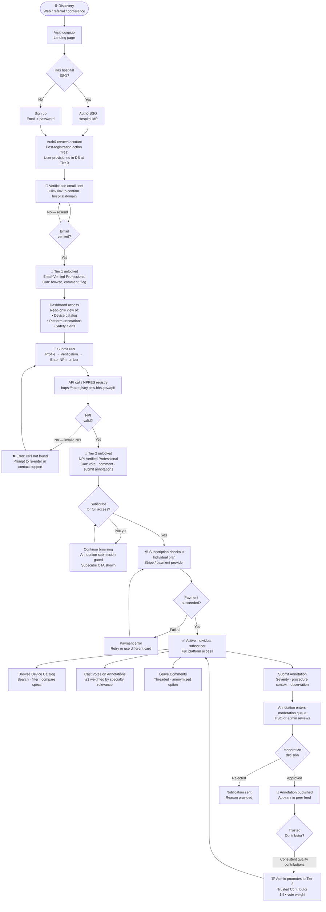
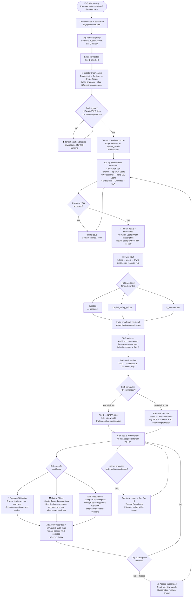
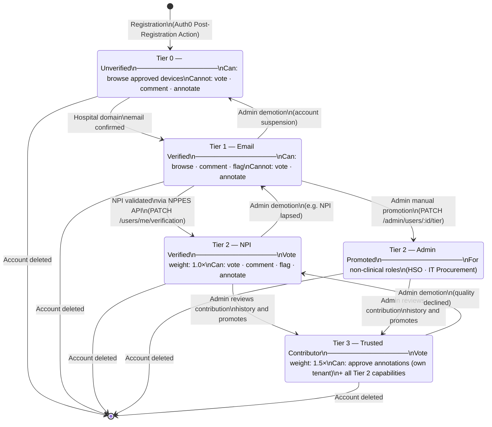
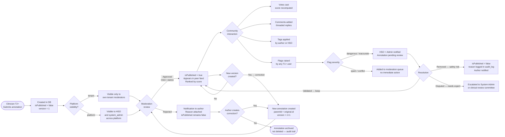

# LogiQo MedTech — User Journey Flowcharts

> **Last updated:** 2026-03-11
> Diagrams are written in [Mermaid](https://mermaid.js.org/). Render in any Mermaid-compatible viewer (GitHub, Notion, VS Code extension, `mermaid.live`).

---

## Journey 1 — Individual Professional Path

A solo clinician (surgeon, safety officer, or specialist) discovers LogiQo independently and subscribes on a personal plan.

---

## Journey 2 — Organizational Path

An organisation (hospital system, health network, or medtech company) onboards as a tenant. An org admin creates the tenant, subscribes at org level, and invites staff who inherit the subscription.

---

## Journey 3 — Verification Tier Lifecycle (Supplemental)

A focused view of how a user's verification tier changes over their lifetime on the platform.

---

## Journey 4 — Annotation Lifecycle (Supplemental)

How a single annotation moves through the platform from submission to archival.

---

## Notes

- All state transitions are written to the **immutable `audit_logs` table** — every tier change, annotation publish/reject, and flag resolution has a tamper-proof record.
- **Subscription gates** (marked 🔒 in the RBAC matrix) apply at the API layer before DB queries are executed.
- The `withTenant()` Prisma helper ensures every DB query in these flows carries the correct RLS tenant context, so cross-tenant data leakage is impossible at the database level.
